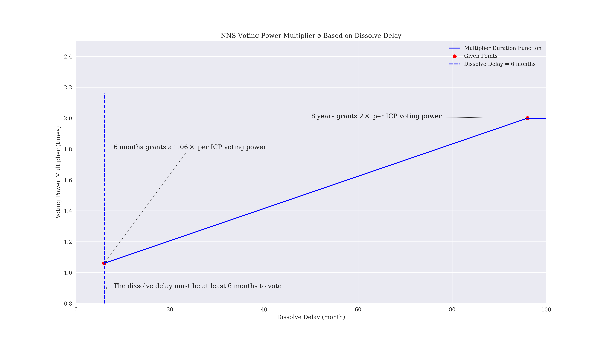
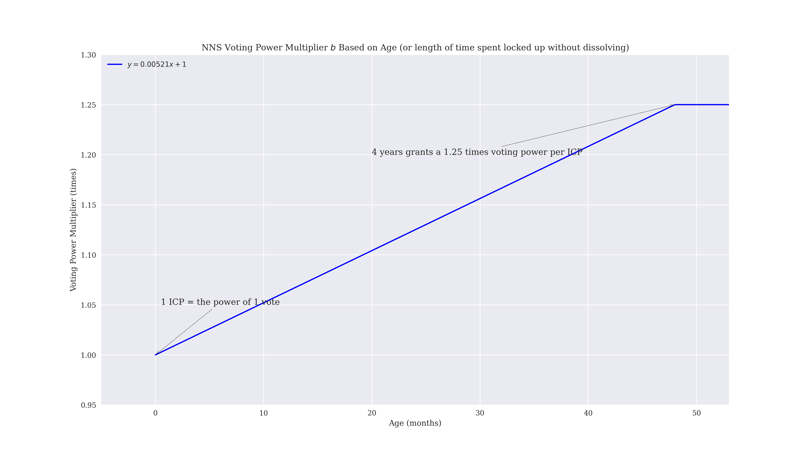

# Network Nervous System (NNS) on the Internet Computer Protocol (ICP)

## Total Rewards

> Total Rewards Yearly

> Total Rewards Daily

## Voting Power Multiplier 

> Duration or Dissolve Delay

> Age

> Combined

